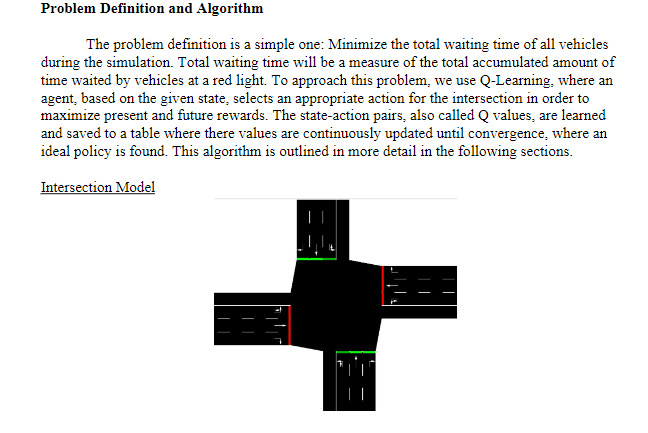
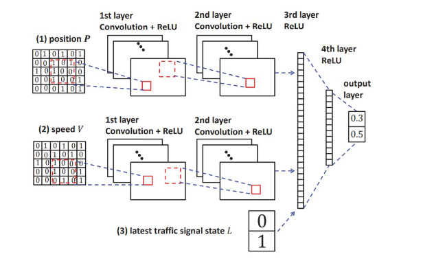
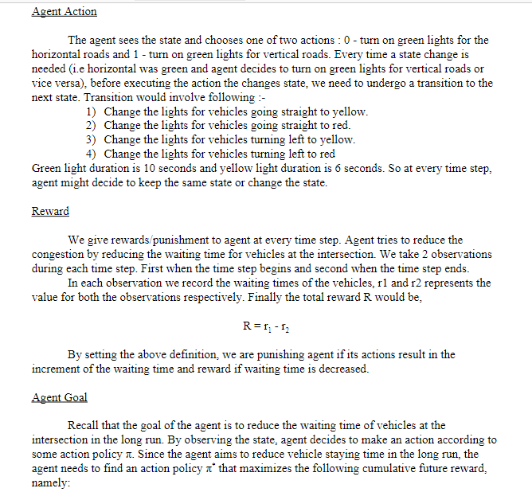

# Traffic Light Control Using Deep Q-Learning Agent

## Description

Ce projet vise à révolutionner la gestion des feux de signalisation à une intersection urbaine en utilisant un agent d'apprentissage renforcé Deep Q-Learning. En simulant le flux de trafic avec l'outil SUMO (Simulation of Urban Mobility), l'objectif principal est d'optimiser les temps de parcours des véhicules en minimisant leur temps d'attente.



**Pour Développement de l'Agent d'Apprentissage Renforcé**

- **Modélisation du Réseau Routier** : Créez un modèle de réseau routier dans SUMO, définissez les itinéraires des véhicules, et configurez les feux de signalisation à l'intersection cible.
- **Implémentation de l'Agent** : Développez un agent de Deep Q-Learning qui interagit avec l'environnement SUMO via TraCI. L'agent apprendra à ajuster les cycles des feux de signalisation pour optimiser le flux de trafic.

### Les outils utilisés

[SUMO](https://sumo.dlr.de/docs/) (Simulation of Urban MObility) est un simulateur de mobilité urbaine open source. SUMO permet aux développeurs de simuler le trafic véhiculaire et piétonnier dans un environnement urbain, leur permettant ainsi de tester et d'évaluer des solutions de mobilité telles que les feux de circulation intelligents, les véhicules autonomes, le covoiturage, et plus encore.

Il est utilisé dans ce projet en tant que simulateur de l'environnement, étant donné le réseau routier et les différentes situations de trafic à gérer.

SUMO fournit également une API appelée [TraCI](https://sumo.dlr.de/docs/TraCI.html) (Traffic Control Interface) pour permettre l'interaction entre le simulateur de trafic et des agents externes, tels que les systèmes de contrôle de trafic intelligents.

## Fichiers de configuration (SUMO)

### 1. `net.net.xml`

C'est un fichier de réseau généré qui intègre les nœuds, les bords et les connexions pour créer le réseau utilisé dans la simulation.

**Exemple :**

```xml
<net version="1.0" junctionCornerDetail="5" limitTurnSpeed="5.50">

<edge id="1si" from="m1" to="0" priority="74">
        <lane id="1si_0" index="0" speed="13.89" length="237.15" shape="251.50,491.75 488.65,491.75"/>
        <lane id="1si_1" index="1" speed="13.89" length="237.15" shape="251.50,495.05 488.65,495.05"/>
        <lane id="1si_2" index="2" speed="13.89" length="237.15" shape="251.50,498.35 488.65,498.35"/>
</edge>

<tlLogic id="0" type="static" programID="0" offset="0">
        <phase duration="31" state="GGggrrrrGGggrrrr"/>
        <phase duration="4" state="yyggrrrryyggrrrr"/>
        <phase duration="6" state="rrGGrrrrrrGGrrrr"/>
        <phase duration="4" state="rryyrrrrrryyrrrr"/>
        <phase duration="31" state="rrrrGGggrrrrGGgg"/>
        <phase duration="4" state="rrrryyggrrrryygg"/>
        <phase duration="6" state="rrrrrrGGrrrrrrGG"/>
        <phase duration="4" state="rrrrrryyrrrrrryy"/>
</tlLogic>

<junction id="0" type="traffic_light" x="500.00" y="500.00" incLanes="4si_0 4si_1 4si_2 2si_0 2si_1 2si_2 3si_0 3si_1 3si_2 1si_0 1si_1 1si_2" intLanes=":0_0_0 :0_1_0 :0_16_0 :0_17_0 :0_4_0 :0_5_0 :0_18_0 :0_19_0 :0_8_0 :0_9_0 :0_20_0 :0_21_0 :0_12_0 :0_13_0 :0_22_0 :0_23_0" shape="490.15,511.35 503.25,511.35 511.35,509.85 511.35,496.75 509.85,488.65 496.75,488.65 488.65,490.15 488.65,503.25">

        <request index="0" response="0000000000000000" foes="1000010000100000" cont="0"/>
        <request index="1" response="0000000000000000" foes="0111110001100000" cont="0"/>
        <request index="2" response="0000001100000000" foes="0110001111100000" cont="1"/>
        <request index="3" response="0100001000010000" foes="0100001000010000" cont="1"/>
        <request index="4" response="0000001000000000" foes="0100001000001000" cont="0"/>
        <request index="5" response="0000011000000111" foes="1100011000000111" cont="0"/>
        <request index="6" response="0011011000000110" foes="0011111000000110" cont="1"/>
        <request index="7" response="0010000100000100" foes="0010000100000100" cont="1"/>
        <request index="8" response="0000000000000000" foes="0010000010000100" cont="0"/>
        <request index="9" response="0000000000000000" foes="0110000001111100" cont="0"/>
        <request index="10" response="0000000000000011" foes="1110000001100011" cont="1"/>
        <request index="11" response="0001000001000010" foes="0001000001000010" cont="1"/>
        <request index="12" response="0000000000000010" foes="0000100001000010" cont="0"/>
        <request index="13" response="0000011100000110" foes="0000011111000110" cont="0"/>
        <request index="14" response="0000011000110110" foes="0000011000111110" cont="1"/>
        <request index="15" response="0000010000100001" foes="0000010000100001" cont="1"/>

 </junction>

 <connection from="1o" to="51i" fromLane="0" toLane="0" via=":1_0_0" dir="s" state="M"/>
 <connection from="1o" to="51i" fromLane="1" toLane="1" via=":1_0_1" dir="s" state="M"/>
 <connection from="1o" to="51i" fromLane="2" toLane="2" via=":1_0_2" dir="s" state="M"/>
 <connection from="1o" to="1i" fromLane="2" toLane="2" via=":1_3_0" dir="t" state="M"/>
 
```

Cette balise commence la définition du réseau avec certains paramètres tels que la version, les détails des jonctions et les limites de vitesse de virage.

### 2. `input_routes.rou.xml`

Ce fichier définit les routes empruntées par les véhicules ainsi que les types de véhicules utilisés dans la simulation.

```xml
<routes>

    <vType id="SUMO_DEFAULT_TYPE" accel="0.8" decel="4.5" sigma="0" length="5" minGap="2" maxSpeed="70"/>

    <route id="always_right" edges="1fi 1si 4o 4fi 4si 2o 2fi 2si 3o 3fi 3si 1o 1fi"/>
    <route id="always_left" edges="3fi 3si 2o 2fi 2si 4o 4fi 4si 1o 1fi 1si 3o 3fi"/>
    <route id="horizontal" edges="2fi 2si 1o 1fi 1si 2o 2fi"/>
    <route id="vertical" edges="3fi 3si 4o 4fi 4si 3o 3fi"/>


    <vehicle id="left_0" type="SUMO_DEFAULT_TYPE" route="vertical" depart="0" />
    <vehicle id="left_1" type="SUMO_DEFAULT_TYPE" route="vertical" depart="2" />
    <vehicle id="right_2" type="SUMO_DEFAULT_TYPE" route="horizontal" depart="3" />
    <vehicle id="down_3" type="SUMO_DEFAULT_TYPE" route="always_right" depart="4" color="1,0,0"/>
    <vehicle id="left_4" type="SUMO_DEFAULT_TYPE" route="vertical" depart="10" />
    <vehicle id="right_5" type="SUMO_DEFAULT_TYPE" route="horizontal" depart="11" />
    <vehicle id="down_6" type="SUMO_DEFAULT_TYPE" route="always_right" depart="16" color="1,0,0"/>
   
</routes>
```

### 3. `cross3ltl.sumocfg`

Ce fichier de configuration est utilisé par SUMO pour charger le réseau et les routes, et pour configurer divers paramètres de simulation.

```xml
<?xml version="1.0" encoding="UTF-8"?>

<configuration xmlns:xsi="http://www.w3.org/2001/XMLSchema-instance" xsi:noNamespaceSchemaLocation="http://sumo.dlr.de/xsd/sumoConfiguration.xsd">

    <input>
        <net-file value="net.net.xml"/>
        <route-files value="input_routes.rou.xml"/>
    </input>

    <processing>
        <time-to-teleport value="-1"/>
    </processing>

    <report>
        <xml-validation value="never"/>
        <duration-log.disable value="true"/>
        <no-step-log value="true"/>
    </report>

</configuration>
```

## Structure du fichier

### 1. `La classe DQNAgent`

Cette classe implémente l'agent utilisant l'algorithme Deep Q-Learning qui est responsable de la prise de décisions basées sur l'état actuel du trafic. L'agent utilise un réseau neuronal pour apprendre et améliorer ses décisions au fil du temps.

#### Constructeur `__init__`

```python
def __init__(self):
    self.gamma = 0.95   # Taux de remise pour les récompenses futures
    self.epsilon = 0.1  # Taux d'exploration pour choisir une action aléatoire
    self.learning_rate = 0.0002  # Taux d'apprentissage pour l'optimisation du modèle
    self.memory = deque(maxlen=200)  # Mémoire des expériences passées pour le replay
    self.model = self._build_model()  # Modèle de réseau de neurones pour Q-learning
    self.action_size = 2  # Nombre d'actions possibles
```

#### Méthode `_build_model`

```python

def _build_model(self):
    # Construction du modèle de réseau de neurones pour l'apprentissage Q
    # Entrée 1 : taille de l'image 12x12x1
    # Convolution layer 1 :  (filters = 16, kernel size=4*4, stride=2, activation='relu')
    # Convolution layer 2 :  (filters = 32, kernel size=2*2, stride=1, activation='relu')
    input_1 = Input(shape=(12, 12, 1))  # Première entrée de l'état (position)
    x1 = Conv2D(16, (4, 4), strides=(2, 2), activation='relu')(input_1)
    x1 = Conv2D(32, (2, 2), strides=(1, 1), activation='relu')(x1)
    x1 = Flatten()(x1)

    # Entrée 2 : taille de l'image 12x12x1
    # Convolution layer 1 :  (filters = 16, kernel size=4*4, stride=2, activation='relu')
    # Convolution layer 2 :  (filters = 32, kernel size=2*2, stride=1, activation='relu')
    input_2 = Input(shape=(12, 12, 1))  # Deuxième entrée de l'état (vitesse)
    x2 = Conv2D(16, (4, 4), strides=(2, 2), activation='relu')(input_2)
    x2 = Conv2D(32, (2, 2), strides=(1, 1), activation='relu')(x2)
    x2 = Flatten()(x2)

    # Entrée 3 : état de taille 2x1
    input_3 = Input(shape=(2, 1))  # Troisième entrée de l'état (feux de circulation)
    x3 = Flatten()(input_3)

    # Concatenation des sorties des trois entrées
    x = keras.layers.concatenate([x1, x2, x3])
    x = Dense(128, activation='relu')(x)
    x = Dense(64, activation='relu')(x)
    x = Dense(2, activation='linear')(x)  # Sortie Q-values pour chaque action

    model = Model(inputs=[input_1, input_2, input_3], outputs=[x])
    model.compile(optimizer=keras.optimizers.RMSprop(learning_rate=self.learning_rate), loss='mse')

    return model
```



#### Méthode `remember`

```python
def remember(self, state, action, reward, next_state, done):
    self.memory.append((state, action, reward, next_state, done))  # Stocke une expérience dans la mémoire
```

#### Méthode `act`

```python
def act(self, state):
    if np.random.rand() <= self.epsilon:
        return random.randrange(self.action_size)  # Choisit une action aléatoire pour l'exploration
    act_values = self.model.predict(state)  # Prédit les Q-values pour chaque action
    return np.argmax(act_values[0])  # Retourne l'action avec la Q-value la plus élevée
```



#### Méthode `replay`

```python
def replay(self, batch_size):
    minibatch = random.sample(self.memory, batch_size)  # Échantillonne un mini-batch de la mémoire
    for state, action, reward, next_state, done in minibatch:
        target = reward
        if not done:
            target = (reward + self.gamma * np.amax(self.model.predict(next_state)[0]))
        target_f = self.model.predict(state)
        target_f[0][action] = target
        self.model.fit(state, target_f, epochs=1, verbose=0)  # Entraîne le modèle sur la mini-batch
```

#### Méthode `load`

```python
def load(self, name):
    self.model.load_weights(name)  # Charge les poids du modèle
```

#### Méthode `save`

```python
def save(self, name):
    self.model.save_weights(name)  # Sauvegarde les poids du modèle
```

### 2. La classe SumoIntersection

Cette classe gère l'environnement de simulation SUMO. Elle est responsable de la génération des fichiers de route, de l'obtention des options de ligne de commande, et de la récupération de l'état de l'intersection. Elle fournit les informations nécessaires pour que l'agent puisse prendre des décisions.

#### Constructeur `__init__`

```python
def __init__(self):
    try:
        sys.path.append(os.path.join(os.path.dirname(__file__), '..', '..', '..', '..', "tools"))
        sys.path.append(os.path.join(os.environ.get("SUMO_HOME", os.path.join(os.path.dirname(__file__), "..", "..", "..")), "tools"))
        from sumolib import checkBinary  # Vérifie la présence des binaires SUMO
    except ImportError:
        sys.exit("please declare environment variable 'SUMO_HOME' as the root directory of your sumo installation")
```

#### Méthode `generate_routefile`

```python
def generate_routefile(self):
    random.seed(42)  # Assure la reproductibilité
    N = 3600  # Nombre d'étapes de temps
    pH = 1. / 7  # Probabilité de véhicules horizontaux
    pV = 1. / 11  # Probabilité de véhicules verticaux
    pAR = 1. / 30  # Probabilité de véhicules tournant toujours à droite
    pAL = 1. / 25  # Probabilité de véhicules tournant toujours à gauche
    with open("input_routes.rou.xml", "w") as routes:
        print('''<routes ...>''', file=routes)
        lastVeh = 0
        vehNr = 0
        for i in range(N):
            if random.uniform(0, 1) < pH:
                print(f'    <vehicle id="right_{vehNr}" ... depart="{i}" />', file=routes)
                vehNr += 1
                lastVeh = i
            if random.uniform(0, 1) < pV:
                print(f'    <vehicle id="left_{vehNr}" ... depart="{i}" />', file=routes)
                vehNr += 1
                lastVeh = i
            if random.uniform(0, 1) < pAL:
                print(f'    <vehicle id="down_{vehNr}" ... depart="{i}" />', file=routes)
                vehNr += 1
                lastVeh = i
            if random.uniform(0, 1) < pAR:
                print(f'    <vehicle id="down_{vehNr}" ... depart="{i}" />', file=routes)
                vehNr += 1
                lastVeh = i
        print("</routes>", file=routes)
```

#### Méthode `get_options`

```python
def get_options(self):
    optParser = optparse.OptionParser()
    optParser.add_option("--nogui", action="store_true", default=False, help="run the commandline version of sumo")
    options, args = optParser.parse_args()
    return options
```

#### Méthode `getState`

```python
def getState(self):
    positionMatrix = []
    velocityMatrix = []
    cellLength = 7
    offset = 11
    speedLimit = 14
    junctionPosition = traci.junction.getPosition('0')[0]

    # Initialisation des matrices de position et de vitesse
    for i in range(12):
        positionMatrix.append([0] * 12)
        velocityMatrix.append([0] * 12)

    vehicles_road1 = traci.edge.getLastStepVehicleIDs('1si')
    vehicles_road2 = traci.edge.getLastStepVehicleIDs('2si')
    vehicles_road3 = traci.edge.getLastStepVehicleIDs('3si')
    vehicles_road4 = traci.edge.getLastStepVehicleIDs('4si')

    for v in vehicles_road1:
        ind = int(abs((junctionPosition - traci.vehicle.getPosition(v)[0] - offset)) / cellLength)
        if ind < 12:
            positionMatrix[2 - traci.vehicle.getLaneIndex(v)][11 - ind] = 1
            velocityMatrix[2 - traci.vehicle.getLaneIndex(v)][11 - ind] = traci.vehicle.getSpeed(v) / speedLimit

    for v in vehicles_road2:
        ind = int(abs((junctionPosition - traci.vehicle.getPosition(v)[0] + offset)) / cellLength)
        if ind < 12:
            positionMatrix[3 + traci.vehicle.getLaneIndex(v)][ind] = 1
            velocityMatrix[3 + traci.vehicle.getLaneIndex(v)][ind] = traci.vehicle.getSpeed(v) / speedLimit

    junctionPosition = traci.junction.getPosition('0')[1]
    for v in vehicles_road3:
        ind = int(abs((junctionPosition - traci.vehicle.getPosition(v)[1] - offset)) / cellLength)
        if ind < 12:
            positionMatrix[6 + 2 - traci.vehicle.getLaneIndex(v)][11 - ind] = 1
            velocityMatrix[6 + 2 - traci.vehicle.getLaneIndex(v)][11 - ind] = traci.vehicle.getSpeed(v) / speedLimit

    for v in vehicles_road4:
        ind = int(abs((junctionPosition

 - traci.vehicle.getPosition(v)[1] + offset)) / cellLength)
        if ind < 12:
            positionMatrix[9 + traci.vehicle.getLaneIndex(v)][ind] = 1
            velocityMatrix[9 + traci.vehicle.getLaneIndex(v)][ind] = traci.vehicle.getSpeed(v) / speedLimit

    return [np.array(positionMatrix), np.array(velocityMatrix), traci.trafficlight.getPhase("0")]
```

### Main Script

Le script principal initialise le simulateur SUMO, crée l'agent DQN, et entraîne l'agent en utilisant les expériences accumulées dans l'environnement SUMO.

```python
def main():
    Sumo = SumoIntersection()
    options = Sumo.get_options()
    if options.nogui:
        sumoBinary = checkBinary('sumo')
    else:
        sumoBinary = checkBinary('sumo-gui')

    Sumo.generate_routefile()

    traci.start([sumoBinary, "-c", "sumo_config.sumocfg", "--tripinfo-output", "tripinfo.xml"])

    agent = DQNAgent()
    batch_size = 32
    state = Sumo.getState()
    state = [np.reshape(state[0], (1, 12, 12, 1)), np.reshape(state[1], (1, 12, 12, 1)), np.reshape(state[2], (1, 2, 1))]

    for time in range(3000):
        action = agent.act(state)

        if action == 1:
            traci.trafficlight.setPhase("0", (traci.trafficlight.getPhase("0") + 1) % 4)

        traci.simulationStep()

        next_state = Sumo.getState()
        next_state = [np.reshape(next_state[0], (1, 12, 12, 1)), np.reshape(next_state[1], (1, 12, 12, 1)), np.reshape(next_state[2], (1, 2, 1))]

        reward = -1 if (action % 2 == 0 and time % 30 != 0) else 1
        done = time == 2999

        agent.remember(state, action, reward, next_state, done)
        state = next_state

        if len(agent.memory) > batch_size:
            agent.replay(batch_size)

    agent.save("dqn_model.h5")
    traci.close()
    sys.stdout.flush()

if __name__ == '__main__':
    main()
```

## Exécution et Simulation

### Instructions

1. **Installation de SUMO et TraCI**: Assurez-vous que SUMO et TraCI sont correctement installés et configurés sur votre système. Vous pouvez suivre les instructions d'installation sur le [site officiel de SUMO](https://sumo.dlr.de/docs/Installing/index.html).
2. **Préparation de l'environnement Python**: Installez les bibliothèques nécessaires pour exécuter l'agent Deep Q-Learning. Les bibliothèques incluent `gym`, `numpy`, `tensorflow` ou `pytorch`, et `traci`. Vous pouvez installer ces bibliothèques en utilisant `pip` avec la commande suivante :

   ```bash
   pip install gym numpy tensorflow traci
   ```
3. **Lancement de la simulation**: Exécutez le script principal pour démarrer la formation de l'agent Deep Q-Learning. Assurez-vous que le script `traffic_light_control.py` est prêt et contient tout le code nécessaire pour la simulation.

   ```bash
   python traffic_light_control.py
   ```

### Simulation dans SUMO

Après l'exécution du code, vous pouvez visualiser la simulation dans l'interface graphique de SUMO. Pour ce faire, utilisez la commande suivante :

```bash
sumo-gui -c cross.sumocfg
```

Cette commande ouvre l'interface graphique de SUMO et charge la configuration définie dans `cross.sumocfg`, permettant de visualiser les performances du modèle de contrôle des feux de signalisation.

### Ressources

- [SUMO Documentation]()
- [TraCI Documentation](https://sumo.dlr.de/docs/TraCI.html)
- [TensorFlow Documentation](https://www.tensorflow.org/)
- [PyTorch Documentation](https://pytorch.org/)

  ---

  Dans le contexte de la simulation du trafic avec SUMO (Simulation of Urban Mobility), les termes **time**, **time wait**, **time lose**, et **time wait emergency** ont des significations spécifiques liées aux performances des véhicules dans la simulation. Voici une explication de chacun de ces termes :

  ### 1. Time

  **Time** dans SUMO représente le temps total écoulé depuis le début de la simulation jusqu'à un point donné. Il peut se référer au temps total passé par un véhicule depuis son départ jusqu'à sa destination. Ce temps inclut tout le temps de trajet actif, les arrêts, les ralentissements, etc.

  ### 2. Time Wait

  **Time Wait** correspond au temps total durant lequel un véhicule est à l'arrêt. C'est le temps pendant lequel le véhicule n'avance pas, souvent dû à des feux de signalisation rouges, des embouteillages, ou d'autres types d'attentes forcées.

  En détail :


  - **Temps d'attente aux feux de signalisation** : Le véhicule attend que le feu passe au vert.
  - **Embouteillages** : Le véhicule est bloqué par d'autres véhicules et ne peut pas avancer.

  ### 3. Time Lose

  **Time Lose** est le temps perdu par un véhicule par rapport à son temps de trajet idéal. Ce concept est basé sur l'idée qu'un véhicule pourrait avoir un temps de trajet minimal dans des conditions parfaites (par exemple, sans feux de signalisation, sans trafic). Le **time lose** est la différence entre ce temps idéal et le temps réel qu'il a pris, incluant les ralentissements, les arrêts, les accélérations et décélérations.

  ### 4. Time Wait Emergency

  **Time Wait Emergency** se réfère au temps d'attente pour des véhicules d'urgence, comme les ambulances, les camions de pompiers, etc. Dans la simulation, il est crucial de minimiser ce temps pour les véhicules d'urgence afin d'améliorer leur réponse rapide. Ce temps est souvent surveillé dans les simulations qui testent des scénarios de priorité pour les véhicules d'urgence, assurant qu'ils puissent passer rapidement à travers le trafic.
